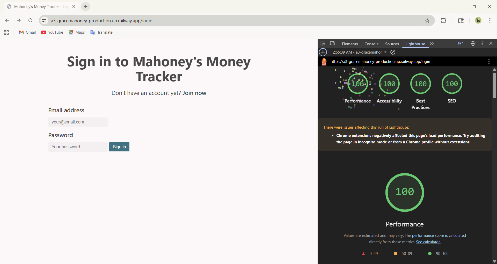

Assignment 3 - Persistence: Two-tier Web Application with Database, Express server, and CSS template
===

Due: Monday, September 22, 2025, by 11:59 PM.
Grace Mahoney

## Mahoney's Money Tracker
**Deployed Project:** [My A3 Project](a3-gracemahoney-production.up.railway.app)

### Goal of the Application
The goal of this application is to help users track their personal expenses efficiently. Users can sign up, login, add, modify, or delete expense transactions, see their total income, total expenses, and net total, filter their transactions by date, and view all of their data in a clean, organized interface. The application persists data in MongoDB and ensures that each user sees only their own data.

### Challenges
- Implementing secure user authentication and password storage using bcrypt
- Making sure each user's data is dynamically loaded after login
- Integrating MongoDB with express
- Passing Google Lighthouse tests with 100, specifically accessibility.

### Authentication Strategy
I chose to use **email + password authentication** with bcrypt for hashing passwords. This was a very straightforward implementation, which involved creating accounts on the join page and verifying existing users and their matching passwords on the login page.

### CSS Framework
I used [Sakura](https://github.com/oxalorg/sakura?tab=readme-ov-file) for its minimal, lightweight, clean design. It provided a basic styling for forms, buttons, etc., which allowed the application to have a professional look without writing my own custom css. 

#### Custom Modifications
- Link font weight - I set the font weight to 600 to accomodate the accessibility contrast requirements.
- Font colors - The error message under the login was changed to red and the color of income/expense was changed to green/red (respectively).

### Express Middleware Packages
express         | The main Node.js framwork used to create routes, handle requests, and serve pages.
mongodb         | Connects to the MongoDB database and allows querying and modifying persistent data.
path            | Provides utilities for working with file and directory paths, used to serve static files and set view paths.
cookie-session  | Manages session data via cookies to keep users logged in between requests.
bcrypt          | Hashses passwords securely and validates login attempts.

## Technical Achievements
- **Tech Achievement 1**: Instead of using Render, I deployed my app on Railway. I found Railway's UI more difficult to navigate than Render. I spent a long time (probably 20 min) trying to find the url to paste into this README, only to realize that my page was private. I then spent a long time trying to change its visibility.

- **Tech Achievement 2**: I recieved 100% in all four lighthouse tests

This achievement probably took me the longest - about an hour. The only error I had was accessibility contrast issues. So, I changed the color to every possible combination, even asking chatgpt for colors that should pass with the app's background and nothing worked. Eventually I read my results more in depth and changed the font weight, which ended up working even without a color change. I am very upset, but I will survive.

- **Tech Achievement 3**: I implemented a date filter that allows users to view expense entries within a selected range. This required creating front-end form inputs for start and end dates, handling form submission with JavaScript, and querying MongoDB on the server to return only relevant entries. This feature improves usability by helping users analyze their expenses over custom periods.

### Design/Evaluation Achievements
- **Design Achievement 1**: CRAP

#### Contrast:
The element that receives the most emphasis on each page is the title and header of the expense tracker, as well as key action buttons such as “Add Expense” and “Sign Out.” I used a darker, highly saturated color against a light background to ensure these elements immediately draw the user’s attention. For example, the header text uses a strong color (#084298) against the light gray background (#f9f9f9), creating a clear visual hierarchy. Important buttons are similarly styled with bold colors and hover effects to indicate interactivity. This use of contrast helps users quickly identify actionable elements and important information on the page, improving usability and overall readability, which is particularly important for accessibility.

#### Repetition:
I applied repetition through consistent use of color schemes, typography, and layout across the entire application. All cards displaying expense entries share the same font, spacing, and shadow effects, creating a unified visual style. Buttons and input fields also maintain consistent shapes, padding, and hover effects throughout the site. By repeating design elements consistently, users can easily grasp the interface structure and understand how recurring components function. Additionally, the color palette is limited to a few complementary colors, which are repeated across headers, links, and buttons to create a coherent visual identity. Repetition makes the interface more predictable and aesthetically pleasing.

#### Alignment:
All elements are aligned using a structured grid layout provided by the CSS framework (Sakura.css), supplemented with custom CSS adjustments. Forms, cards, and navigation links are aligned consistently either to the left or center, depending on context, to provide a clean and organized layout. The use of alignment helps guide the eye naturally through the page, making it easy to locate related information. For example, input labels are aligned with their corresponding fields, and the submit buttons are aligned with form sections to maintain a logical flow. Alignment also increases contrast between grouped and ungrouped content, clarifying relationships between elements.

#### Proximity:
Proximity was used to group related items together and separate unrelated content to improve comprehension and usability. Expense details such as date, category, and amount are grouped within the same card to indicate they belong together, while actions such as “Edit” and “Delete” are positioned near each card to maintain context. Navigation links, login fields, and error messages are similarly grouped in logical sections, with spacing between unrelated content to reduce cognitive load. This clear grouping helps users quickly understand which items are connected and which are distinct, making the interface intuitive and minimizing the chance of user errors. Proper use of proximity also enhances the visual flow and overall readability of the site.

[Join Page](./join.png)
[Login Page](./login.png)
[Expense Dashboard](./dashboard.png)

Resources:
CSS template: Sakura (https://github.com/oxalorg/sakura?tab=readme-ov-file)
https://expressjs.com/en/starter/basic-routing.html
https://expressjs.com/en/guide/routing.html?utm_source=chatgpt.com
https://medium.com/%40itsdavidmandal/crafting-a-login-and-signup-system-with-node-js-express-js-and-mongodb-11b4bcad6da6
https://www.w3docs.com/snippets/css/how-to-override-css-styles.html