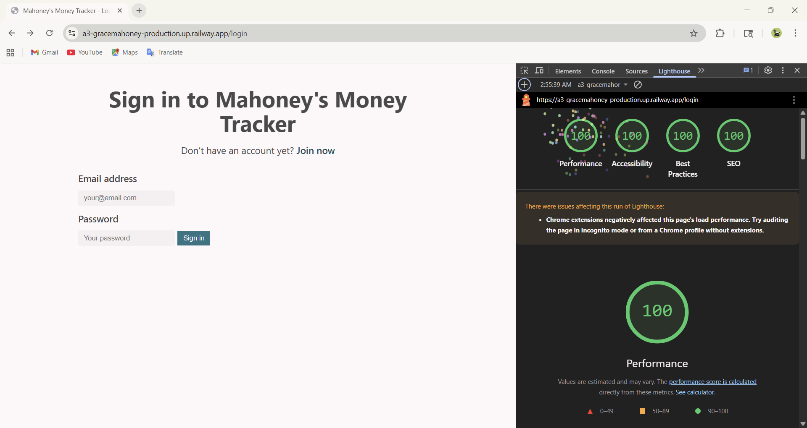

Assignment 3 - Persistence: Two-tier Web Application with Database, Express server, and CSS template
===

Due: Monday, September 22, 2025, by 11:59 PM.
Grace Mahoney

## Mahoney's Money Tracker
**Deployed Project:** [My A3 Project](a3-gracemahoney-production.up.railway.app)

### Goal of the Application
The goal of this application is to help users track their personal expenses efficiently. Users can sign up, login, add, modify, or delete expense transactions, see their total income, total expenses, and net total, filter their transactions by date, and view all of their data in a clean, organized interface. The application persists data in MongoDB and ensures that each user sees only their own data.

### Challenges
- Implementing secure user authentication and password storage using bcrypt
- Making sure each user's data is dynamically loaded after login
- Integrating MongoDB with express
- Passing Google Lighthouse tests with 100, specifically accessibility.

### Authentication Strategy
I chose to use **email + password authentication** with bcrypt for hashing passwords. This was a very straightforward implementation, which involved creating accounts on the join page and verifying existing users and their matching passwords on the login page.

### CSS Framework
I used [Sakura](https://github.com/oxalorg/sakura?tab=readme-ov-file) for its minimal, lightweight, clean design. It provided a basic styling for forms, buttons, etc., which allowed the application to have a professional look without writing my own custom css. 

#### Custom Modifications
- Link font weight - I set the font weight to 600 to accomodate the accessibility contrast requirements.
- Font colors - The error message under the login was changed to red and the color of income/expense was changed to green/red (respectively).

### Express Middleware Packages
express         | The main Node.js framwork used to create routes, handle requests, and serve pages.
mongodb         | Connects to the MongoDB database and allows querying and modifying persistent data.
path            | Provides utilities for working with file and directory paths, used to serve static files and set view paths.
cookie-session  | Manages session data via cookies to keep users logged in between requests.
bcrypt          | Hashses passwords securely and validates login attempts.

## Technical Achievements
- **Tech Achievement 1**: I used OAuth authentication via the GitHub strategy

I used Railway. Difficulty navigating - could not figure out how to change visibility and could not find url for a solid 20 min.

100 lighthouse - honestly probably took an hour to fix the constrast issue with my links. I changed the color to every possible combination, even asking chatgpt for colors that should pass and nothing worked. Eventually I read further and changed the font weight, which ended up working even without a color change. I am very upset, but I will survive.

### Design/Evaluation Achievements
- **Design Achievement 1**: I followed the following tips from the W3C Web Accessibility Initiative...

CSS template: Sakura (https://github.com/oxalorg/sakura?tab=readme-ov-file)

Resources:
https://expressjs.com/en/starter/basic-routing.html
https://expressjs.com/en/guide/routing.html?utm_source=chatgpt.com
https://medium.com/%40itsdavidmandal/crafting-a-login-and-signup-system-with-node-js-express-js-and-mongodb-11b4bcad6da6
https://www.w3docs.com/snippets/css/how-to-override-css-styles.html